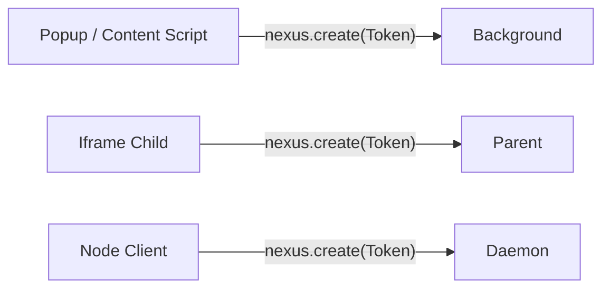

# Nexus

**Type-safe services instead of cross-context message protocols.**

[](https://github.com/c-w-xiaohei/nexus/actions/workflows/quality-check.yml)
[](https://www.npmjs.com/package/@nexus-js/core)
[](https://www.npmjs.com/package/@nexus-js/core)

Nexus connects Chrome extension contexts, iframes, workers, and local Node processes through one TypeScript service model. Define a contract once, get compile-time checks from provider to caller, select targets explicitly, and use the same runtime semantics for RPC, remote resources, authorization, lifecycle, and synchronized state.

## Install

Install the core runtime and the adapter for your environment. For a Chrome extension:

```bash
# pnpm
pnpm add @nexus-js/core @nexus-js/chrome

# npm
npm install @nexus-js/core @nexus-js/chrome

# yarn
yarn add @nexus-js/core @nexus-js/chrome

# bun
bun add @nexus-js/core @nexus-js/chrome
```

Use `@nexus-js/iframe` or `@nexus-js/node-ipc` instead of `@nexus-js/chrome` for those runtimes. The [package map](docs/packages.md) covers every package and subpath export.

### AI Coding Skill

Nexus includes a `use-nexus` skill that helps coding agents follow its public API, targeting, lifecycle, adapter, State, Relay, and testing conventions. Install it with [`npx skills`](https://skills.sh/).

Project-level installation:

```bash
npx skills add c-w-xiaohei/nexus --skill use-nexus -y
```

Global installation:

```bash
npx skills add c-w-xiaohei/nexus --skill use-nexus -g -y
```

Install it only for selected agents:

```bash
npx skills add c-w-xiaohei/nexus --skill use-nexus --agent claude-code cursor -y
```

Or use it once without installing:

```bash
npx skills use c-w-xiaohei/nexus@use-nexus
```

Then ask your coding agent to use the `use-nexus` skill when writing or reviewing Nexus application code. The skill is a compact usage guide; use the linked documentation for non-trivial architecture, policy, and lifecycle decisions.



## Why Nexus?

Cross-context applications often start with a few message names and handlers. As the application grows, those messages accumulate duplicated payload types, manual routing, hidden target selection, and ad hoc disconnect handling.

Nexus gives you:

- **Keep service calls type-safe end to end.** One `Token<T>` connects the provider implementation, method arguments, return values, and remote caller to the same TypeScript contract.
- **Stop duplicating message names and payload types.** Import the shared contract from every participating context instead of maintaining parallel protocol definitions.
- **Make target selection explicit.** Select tabs, frames, and processes with descriptors or matchers instead of hidden global discovery.
- **Treat disconnects as real lifecycle events.** Session-bound proxies do not silently survive service worker, iframe, or daemon replacement.
- **Use the same model across supported runtimes.** First-party adapters connect Chrome extension contexts, iframes, and local Node processes.
- **Go beyond request/response RPC when needed.** Add callbacks, remote resources, synchronized state, authorization, and explicit relays without inventing another protocol.

## Quick Start: Chrome Extension

Define the contract and token in code shared by both contexts:

```ts
// shared/settings.ts
import { Token } from "@nexus-js/core";

export interface SettingsService {
  getTheme(): Promise<"light" | "dark">;
  setTheme(theme: "light" | "dark"): Promise<void>;
}

export const SettingsToken = new Token<SettingsService>("example:settings");
```

Provide the service from the background context:

```ts
// background.ts
import { usingBackgroundScript } from "@nexus-js/chrome";
import { SettingsToken, type SettingsService } from "./shared/settings";

const settings: SettingsService = {
  async getTheme() {
    const result = await chrome.storage.local.get("theme");
    return result.theme === "dark" ? "dark" : "light";
  },
  async setTheme(theme) {
    await chrome.storage.local.set({ theme });
  },
};

usingBackgroundScript().provide(SettingsToken, settings);
```

Create a typed proxy from a content script or popup:

```ts
// content.ts
import { nexus } from "@nexus-js/core";
import { usingContentScript } from "@nexus-js/chrome";
import { SettingsToken } from "./shared/settings";

usingContentScript();

async function main() {
  const settings = await nexus.create(SettingsToken, {
    target: { descriptor: { context: "background" } },
  });

  await settings.setTheme("dark");
  console.log(await settings.getTheme());
}

void main();
```

### What Just Happened?

1. `Token<T>` connected a stable runtime service identity to its TypeScript contract.
2. Both contexts configured their own Nexus endpoint.
3. The background context provided the service implementation.
4. The content script selected the background and created a typed, session-bound proxy.

Calls through the proxy are asynchronous and type-checked end to end.

See the [Chrome adapter guide](packages/chrome/README.md) for popup, options page, DevTools, offscreen document, metadata, and multi-content-script targeting.

## Choose Your Runtime

| Use case                        | Install                                 | Start here                                  |
| ------------------------------- | --------------------------------------- | ------------------------------------------- |
| Chrome extension contexts       | `@nexus-js/core` + `@nexus-js/chrome`   | [Chrome adapter](packages/chrome/README.md) |
| Parent page and iframe          | `@nexus-js/core` + `@nexus-js/iframe`   | [Iframe guide](docs/iframe/README.md)       |
| Local daemon and clients        | `@nexus-js/core` + `@nexus-js/node-ipc` | [Node IPC guide](docs/node-ipc/README.md)   |
| Worker or custom transport      | `@nexus-js/core`                        | [Platform guide](docs/platforms.md)         |
| Remote synchronized state       | `@nexus-js/core`                        | [Nexus State](docs/state/README.md)         |
| React bindings for remote state | `@nexus-js/core` + `@nexus-js/react`    | [React guide](docs/state/react.md)          |
| Application unit tests          | `@nexus-js/testing`                     | [Testing guide](docs/testing/README.md)     |

`@nexus-js/core/state` and `@nexus-js/core/relay` are subpath exports of `@nexus-js/core`, not separately installed packages. See the [package map](docs/packages.md) for install and import details.

## Advanced Capabilities

Once the basic service path works, Nexus can use the same identity, targeting, and lifecycle model for:

- [synchronized remote state](docs/state/README.md) and [React bindings](docs/state/react.md)
- callbacks and disposable remote resources
- [connection and service authorization](docs/auth-and-policy.md)
- [explicit service and store relays](docs/relay.md) across adjacent Nexus graphs
- [custom transport endpoints](docs/platforms.md#worker--custom-runtime)

Nexus does not hide topology behind ambient discovery. If a target is ambiguous, application code must choose the intended endpoint or explicitly choose a multicast strategy.

## Lifecycle And Safety

Remote proxies and references are session-bound. After a disconnect, Chrome service worker restart, daemon restart, or other session replacement, recreate the handle and apply retry policy at the application boundary.

Nexus makes this explicit because retry safety depends on the operation. It cannot infer whether repeating a remote mutation is valid for your application.

For production use, read:

- [Concepts and lifecycle](docs/concepts.md)
- [Authorization and policy](docs/auth-and-policy.md)
- [State lifecycle and errors](docs/state/lifecycle-and-errors.md)
- [Node IPC runtime compatibility](docs/node-ipc/runtime-compatibility.md)

## Documentation

- **Start using Nexus:** [Getting started](docs/getting-started.md)
- **Choose packages and adapters:** [Package map](docs/packages.md) and [platform guide](docs/platforms.md)
- **Understand targeting and lifecycle:** [Core concepts](docs/concepts.md)
- **Synchronize remote state:** [Nexus State](docs/state/README.md)
- **Forward services between graphs:** [Nexus Relay](docs/relay.md)
- **Test application code:** [Testing guide](docs/testing/README.md)
- **Browse all documentation:** [Documentation home](docs/README.md)

## Repository Development

This repository is a pnpm/Turbo monorepo. To work on Nexus itself:

```bash
git clone https://github.com/c-w-xiaohei/nexus.git
cd nexus
pnpm install -w
pnpm build
pnpm test
```

## License

MIT
