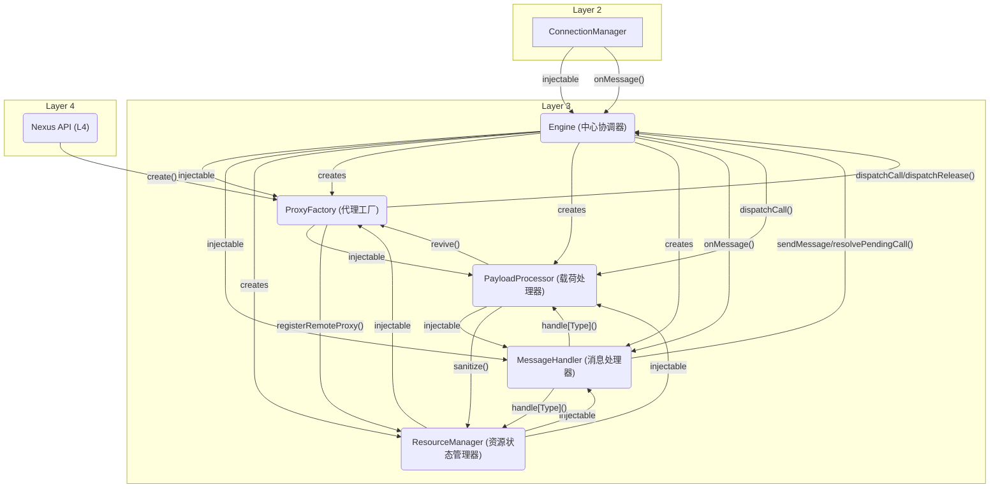

```mermaid
graph TD
    subgraph Layer 2
        ConnectionManager
    end

    subgraph Layer 3
        %% 核心类定义
        Engine("Engine (中心协调器)")
        MessageHandler("MessageHandler (消息处理器)")
        ProxyFactory("ProxyFactory (代理工厂)")
        PayloadProcessor("PayloadProcessor (载荷处理器)")
        ResourceManager("ResourceManager (资源状态管理器)")

        %% 构造函数依赖注入
        ConnectionManager -- injectable --> Engine
        Engine -- injectable --> ProxyFactory
        ResourceManager -- injectable --> ProxyFactory
        ResourceManager -- injectable --> PayloadProcessor
        ProxyFactory -- injectable --> PayloadProcessor
        Engine -- injectable --> MessageHandler
        ResourceManager -- injectable --> MessageHandler
        PayloadProcessor -- injectable --> MessageHandler

        %% 创建关系 (Engine是所有L3模块的创建者)
        Engine -- creates --> ResourceManager
        Engine -- creates --> ProxyFactory
        Engine -- creates --> PayloadProcessor
        Engine -- creates --> MessageHandler

        %% 运行时方法调用关系
        ProxyFactory -- "dispatchCall/dispatchRelease()" --> Engine
        MessageHandler -- "sendMessage/resolvePendingCall()" --> Engine

        Engine -- "onMessage()" --> MessageHandler
        Engine -- "dispatchCall()" --> PayloadProcessor

        MessageHandler -- "handle[Type]()" --> PayloadProcessor
        MessageHandler -- "handle[Type]()" --> ResourceManager

        PayloadProcessor -- "sanitize()" --> ResourceManager
        PayloadProcessor -- "revive()" --> ProxyFactory

        ProxyFactory -- "registerRemoteProxy()" --> ResourceManager

    end

    subgraph Layer 4
        NexusAPI("Nexus API (L4)")
    end

    NexusAPI -- "create()" --> ProxyFactory
    ConnectionManager -- "onMessage()" --> Engine


```
