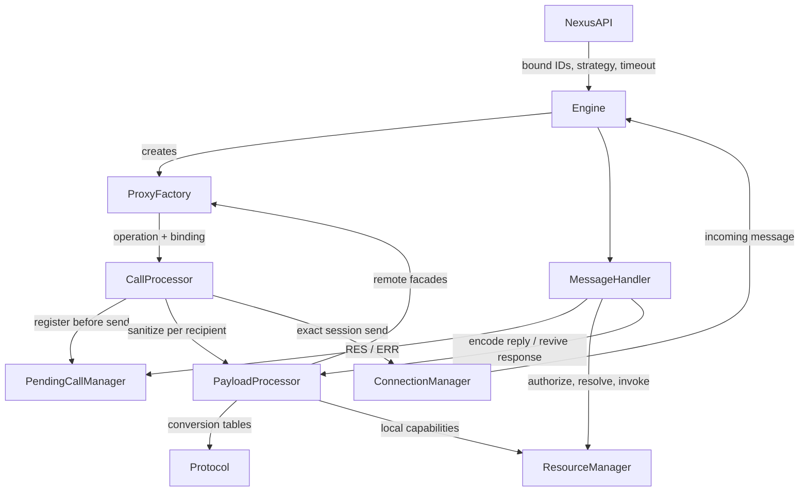

# Layer 3: Service Runtime

`Engine` owns runtime composition and connection lifecycle. Layer 2 owns
connection matching, dialing and routing; Layer 3 only dispatches to sessions
bound when a proxy is created.

## Dispatch And Ownership

- `CallBinding` pairs one connection with `one`, or a fixed connection list with
  `all` / `stream`. Timeout is explicit. `staleTarget.where` only observes
  selection invalidation; it does not reroute calls.
- Check bound sessions before allocating pending state or capabilities. Register
  pending before sending because an in-process transport can reply synchronously.
- Sanitize and send separately for each recipient. A failed handoff releases only
  that recipient's outgoing capabilities; earlier accepted capabilities remain.
- Collect calls settle with `Result`. Streams preserve target order. Normal
  completion keeps queued results readable; cancellation releases both queued
  and ordering-buffered capabilities, never already delivered results.

## Incoming Requests

- `MessageHandler` owns the single RES/ERR reply for requests. Responses and
  RELEASE notifications are never answered with ERR. Failed RES handoffs release
  the newly encoded capabilities.
- The private `prepareReply` flow authorizes before reading property paths and rechecks
  resource ownership after asynchronous authorization. The authorized policy
  snapshot, including `undefined`, accompanies returned capabilities.
- APPLY keeps `invokeStart -> revive -> Reflect.apply -> finally invokeEnd`
  synchronous, then awaits the returned value. GET transports the property value
  without awaiting it. State and Relay depend on this distinction.
- The resource host determines service attribution; a remote resource ID must
  not be resolved against the caller's unrelated local resource registry.

## Payload And Lifetime

`CallProcessor` and `MessageHandler` are per-Engine classes. Constructor-injected
dependencies stay on the instance; shared methods handle dispatch and request
execution without forwarding context through each helper. `ProxyFactory` also
shares its trap methods, with weak target metadata carrying paths and resource
lifetime scopes. Request execution and reply encoding remain private to
`MessageHandler`; no separate request handler or request-result contract is needed.

`protocol.ts` retains independent sanitizer and reviver tables. Payload traversal
and capability rollback belong to `PayloadProcessor`; wire conversion semantics
are not part of request dispatch. Late responses release only resource identities
not already registered locally. Proxy release remains idempotent, while discarding
a facade unregisters its finalizer without releasing the shared resource identity.
