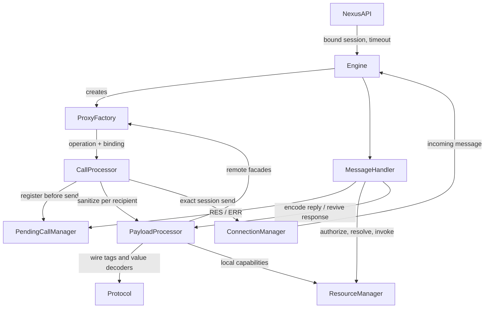

# Layer 3: Service Runtime

`Engine` owns runtime composition and connection lifecycle. Layer 2 owns
connection matching, dialing and routing; Layer 3 only dispatches to sessions
bound when a proxy is created.

## Dispatch And Ownership

- Lazy GET/APPLY closures start on first consumption and share one Result across
  safe and throw-style consumers. Inspecting paths or declaring calls never sends.
  Remote assignment is unsupported; writes use explicit business methods.
  RELEASE is also best-effort with send-failure logging, not a remote cleanup ACK.

- `CallBinding` captures one connection ID and an explicit timeout. `staleTarget.where` only observes
  selection invalidation; it does not reroute calls.
- Check bound sessions before allocating pending state or capabilities. Register
  pending before sending because an in-process transport can reply synchronously.
- A failed handoff releases outgoing capabilities allocated for that request.
- Each pending request has one peer and settles with one Result. Collection
  composition uses ordinary JavaScript outside L3.

## Incoming Requests

- `MessageHandler` owns the single RES/ERR reply for requests. Responses and
  RELEASE notifications are never answered with ERR. Failed RES handoffs release
  the newly encoded capabilities.
- The private `prepareReply` flow authorizes before reading property paths and rechecks
  resource ownership after asynchronous authorization. The authorized policy
  snapshot, including `undefined`, accompanies returned capabilities.
- APPLY keeps `invokeStart -> revive -> Reflect.apply -> finally invokeEnd`
  synchronous, then awaits the returned value. GET transports the property value
  without awaiting it. State and Relay depend on this distinction.
- `invoke` owns that synchronous scope; `prepareReply` only selects the operation
  and encodes its result. `safeReply` keeps execution errors separate from the
  single reply handoff, so send failures never cause reply loops.
- The resource host determines service attribution; a remote resource ID must
  not be resolved against the caller's unrelated local resource registry.

## Payload And Lifetime

All L3 runtime components are per-Engine classes; the class is also the instance
type, without a parallel `Runtime` interface or factory return object. Only
authorization and service creation retain model-dependent types. Dependency
signatures reuse existing methods rather than redefining transport contracts.
`ProxyFactory` captures the binding and path directly in each proxy's closures.
Resource facades additionally share a release
state, which doubles as the finalizer anchor and does not point back to a facade.
Service facades have no resource lifecycle state.

`protocol.ts` defines wire tags and pure value decoders. Payload traversal
and capability rollback belong to `PayloadProcessor`; wire conversion semantics
are not part of request dispatch. Late responses release only resource identities
not already registered locally. Proxy release remains idempotent, while discarding
a facade unregisters its finalizer without releasing the shared resource identity.
